# 接口功能说明
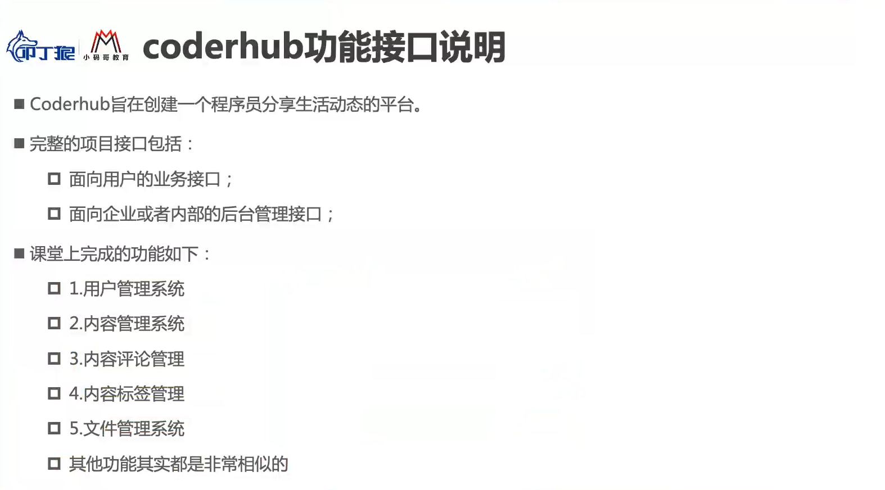
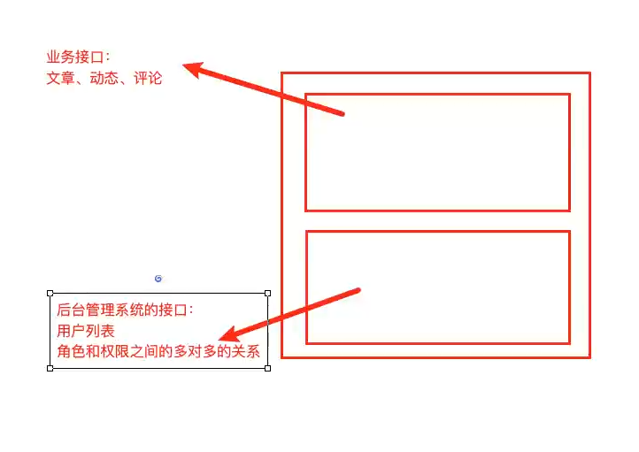
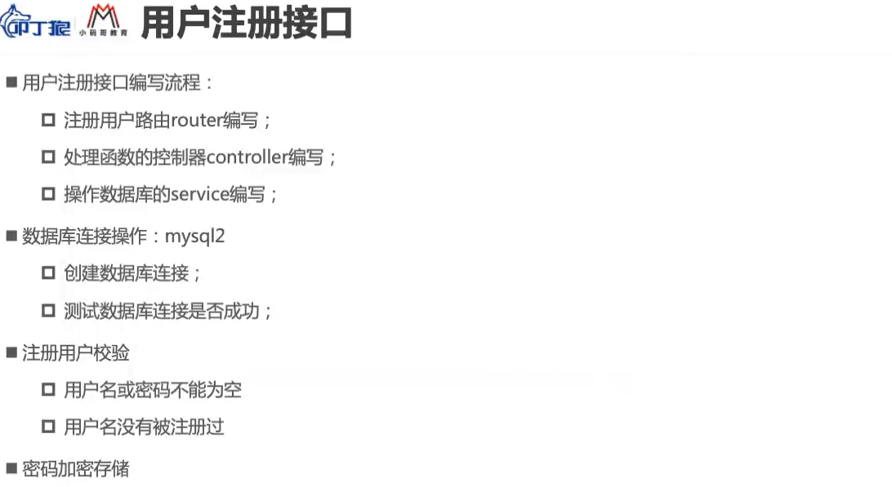
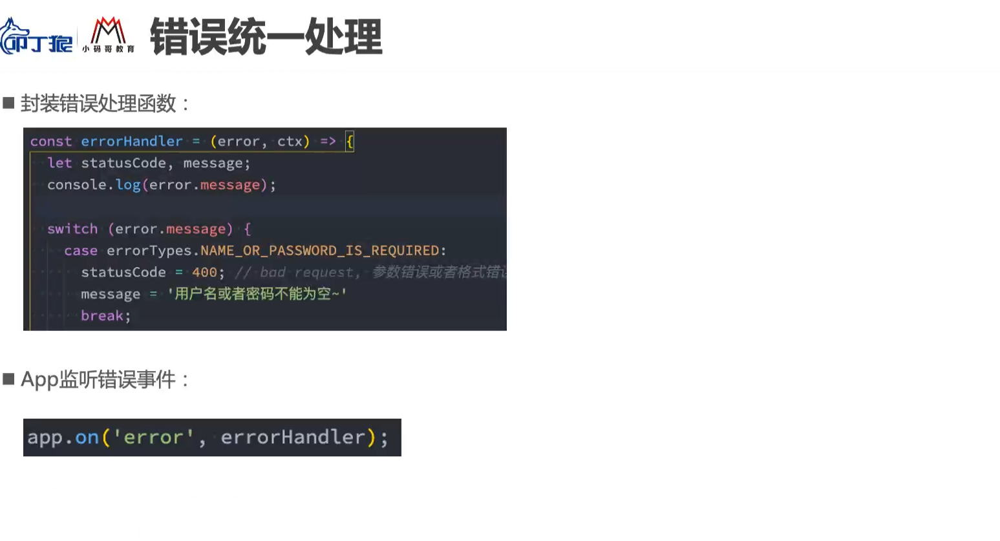
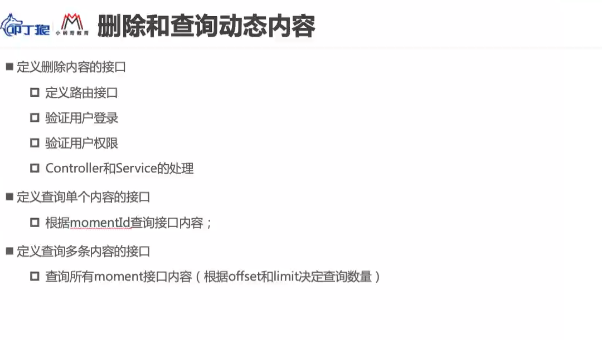
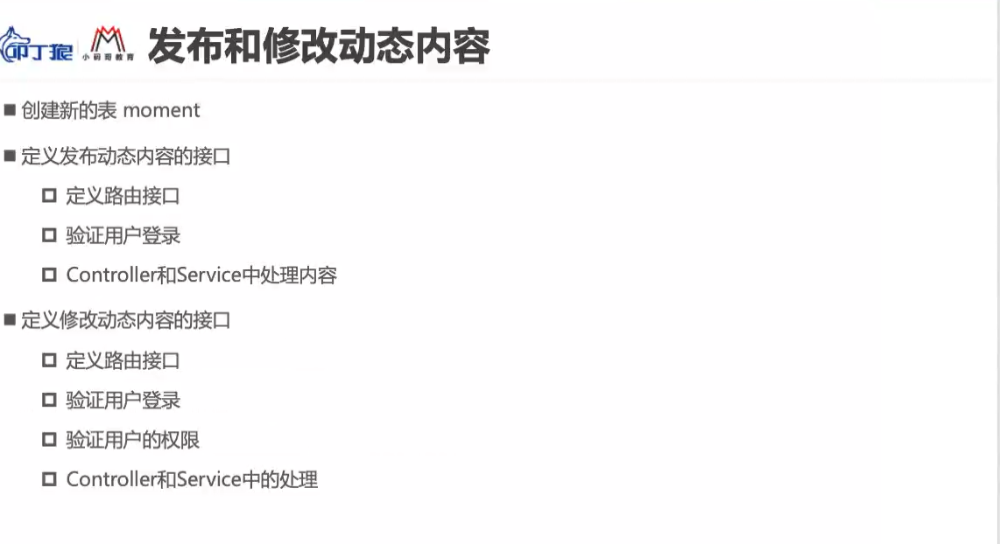

## 登录凭证
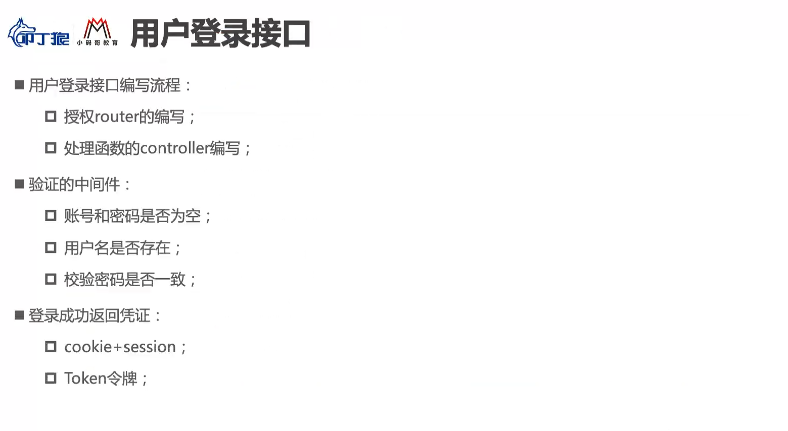
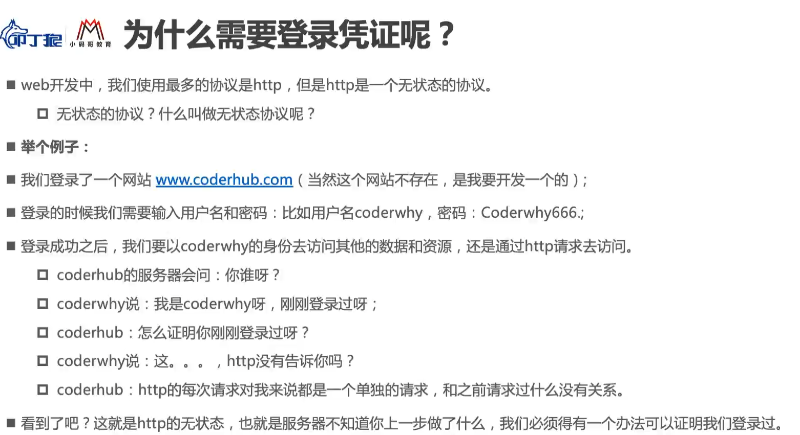

## 认识cookie
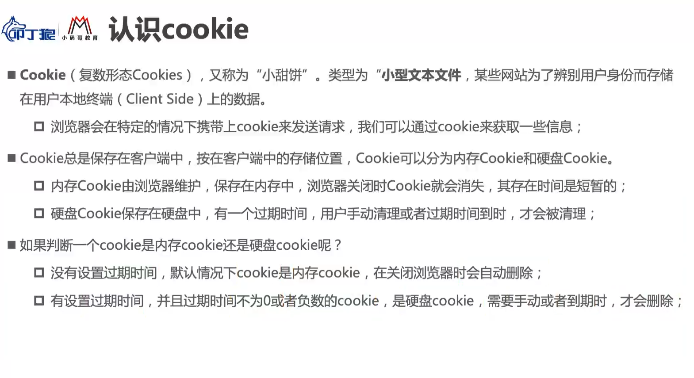
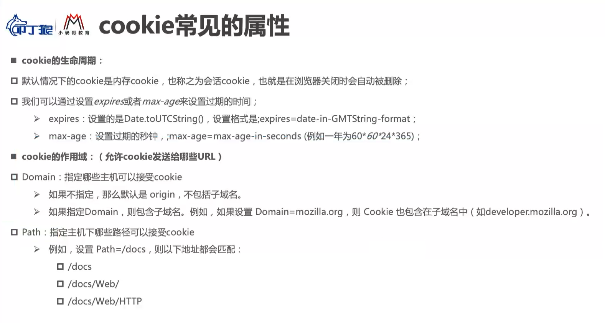

## 设置cookie
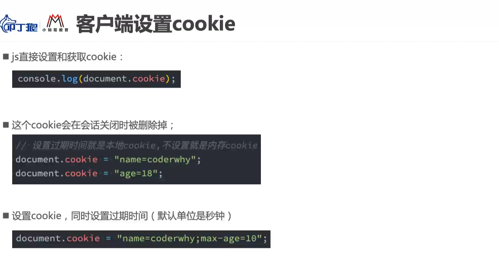
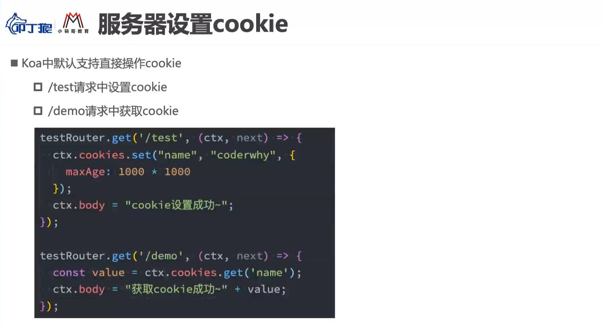

## session是基于cookie实现机制
### Koa-Session简单介绍
session是另一种记录客户状态的机制，不同的是Cookie保存在客户端浏览器中，而session保存在服务器上。
### Session的工作流程
当浏览器访问服务器并发送第一次请求时，服务器端会创建一个session对象，生成一个类似于key,value的键值对， 然后将key(cookie)返回到浏览器(客户)端，浏览器下次再访问时，携带key(cookie)，找到对应的session(value)。 客户的信息都保存在session中
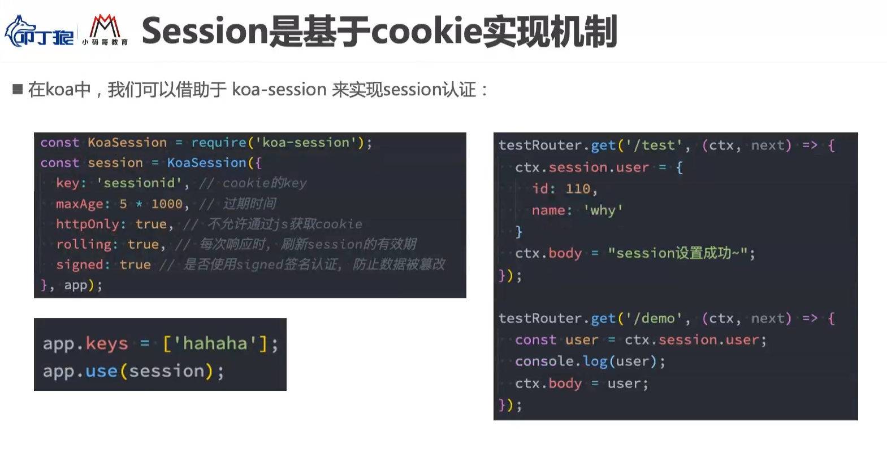

## 认识token
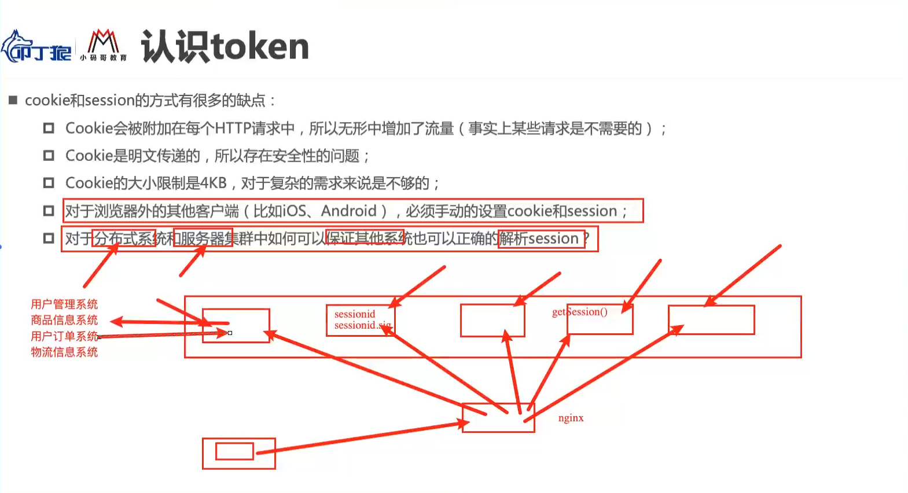
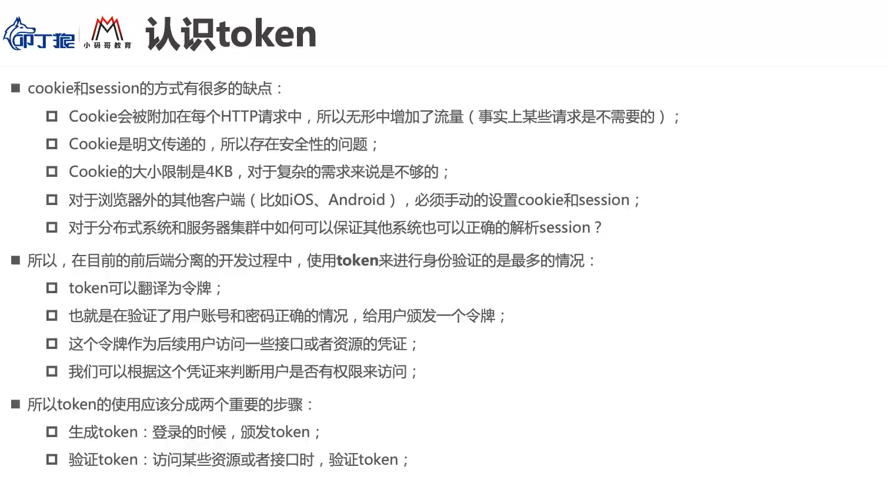

## JWT实现Token机制
### 对称加密
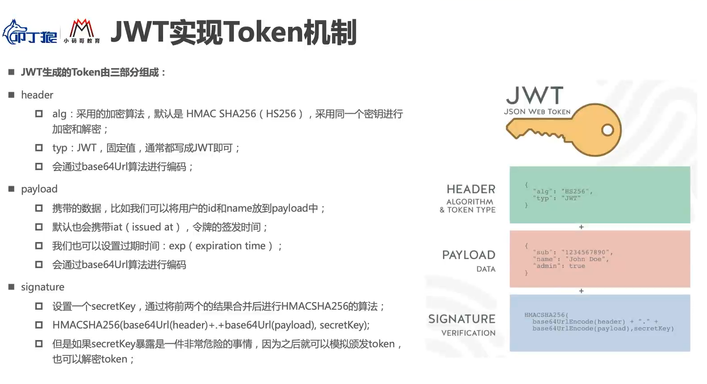
### 非对称加密 
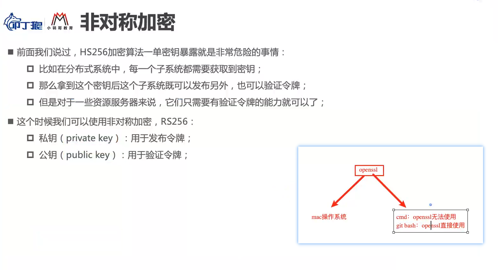
```
    git bash终端
    openssl 进入openssl
    genrsa -out private.key 1024 生成私钥并导出(长度1024)
    rsa -in private.key -pubout -out public.key 运用私钥生成一个公钥并导出
```